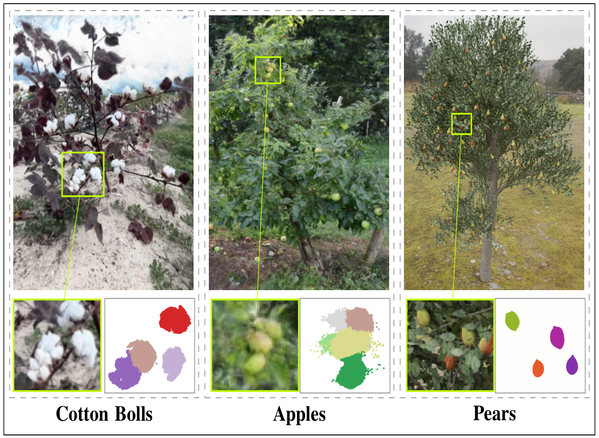

## CropNeRF: A Neural Radiance Field-Based Framework for Crop Counting


### Overview

Rigorous crop counting is crucial for effective agricultural management and
informed intervention strategies.  However, in outdoor field environments,
partial occlusions combined with inherent ambiguity in distinguishing clustered
crops from individual viewpoints poses an immense challenge for image-based
segmentation methods.

<p align="center">
  
</p>

This repository provides source code for our 2025  International Conference on Robotics
and Automation titled "[CropNeRF: A Neural Radiance Field-Based
Framework for Crop Counting](https://arxiv.org/pdf/2312.10922.pdf)." 
To address these problems, we introduce a novel crop
counting framework designed for exact enumeration via 3D instance segmentation.
Our approach utilizes 2D images captured from multiple viewpoints and associates
independent instance masks for neural radiance field (NeRF)-based view
synthesis. We introduce crop visibility and mask consistency scores, which are
incorporated alongside 3D information from a NeRF model. This results in an
effective segmentation of crop instances in 3D and highly-accurate crop counts.
Furthermore, our method eliminates the dependence on crop-specific parameter
tuning. We validate our framework on two infield agricultural datasets
consisting of cotton bolls and apples, and demonstrate consistent counting
performance despite major variations in crop color, shape, and size.

More information on the project can be found on the 
[CropNeRF website](https://robotic-vision-lab.github.io/ntrack).

### Citation

If you find this project useful, then please consider citing both our paper and
dataset.

```bibitex
@inproceedings{cropNeRF,
  title={CropNeRF: A Neural Radiance Field-Based Framework for Crop Counting},
  author={Al Muzaddid, Md Ahmed and Beksi, William J},
  year={2025}
}
```

### CropNeRF Pipeline 

<p align="center">
  
</p>

### Installation 

First, begin by cloning the project:

    $ git clone https://github.com/robotic-vision-lab//CropNeRF-Crop-Phenotyping-in-3D.git
    $ cd CropNERF-Crop-Phenotyping-in-3D

Next, build a docker image and run in a container:

    $ docker build -t cropnerf .
    $ docker run -v {current_directory}:/opt/project -v {CropNeRF25_directory}:/opt/data  -p 0.0.0.0:7007:7007 -it --rm --gpus all cropnerf /bin/bash

Set enviroment variables:
    
    $ export NERFSTUDIO_METHOD_CONFIGS=fruit_nerf=fruit_nerf.fruit_nerf_config:fruit_nerf_method
    $ export PYTHONPATH=$PYTHONPATH:/opt/project/cotton_nerf/fruit_nerf

### Dataset 

Download the [CropNeRF25](...) dataset files.
CotNERF25 consists of eight folder for 3D reconstruction. Each folder
contains images and SegmentationObject subfolder. The dataset directories have the following structure:

```
CropNeRF25/
  - tree_01
    - images
      - frame_00001.jpg
      - frame_00002.jpg
      - ...
    - SegmentationObject
      - frame_00001.jpg
      - frame_00002.jpg
      - ...
   
  - tree_02
    - images
      - frame_00001.jpg
      - frame_00002.jpg
      - ...
    - SegmentationObject
      - frame_00001.jpg
      - frame_00002.jpg
      - ...
```

### Usage 

# Covert Segmentation Image to Label Image
    $ python fruit_nerf/utils/convert_segmentation_img_to_label.py 'tree_01'


# Pointcloud Generation
We borrowed the 3D pointcloud generation part from [FruitNeRF] {...} paper. To train the NeRF model to generate 3D
pointcloud invoke the following command: 

    $ python debug/train.py fruit_nerf --data /opt/data/training_data/tree_01 --output-dir /opt/data/trained_model
    $ ns-export pointcloud --load-config /opt/data/trained_model/tree_01/fruit_nerf/{filename}/config.yml --output-dir exports/pcd/ --num-points 10000000 --remove-outliers True --normal-method open3d --save-world-frame False --obb_center -0.0571471367 0.1105365818 -0.5400721172 --obb_rotation 0.0000000000 0.0000000000 0.0000000000 --obb_scale 1.0000000000 1.0000000000 1.0000000000
    
# Segment Pointcloud into Super-cluster and Sub-clusters
    $ python segmentation/segmenter.py tree_01

# Export Projection from the Model
    $python fruit_nerf/scripts/semantic_projection.py pointcloud --load-config /opt/data/trained_model/tree_01/fruit_nerf/{filename}/config.yml --output-dir /opt/data/outputs/exports/pcd/


# Merge Sub-clusters into Crop Instances
    $ python segmentation/merger.py --base_dir {base_directory} --recording_name tree_01


### CropNeRF Source Code License

[](...)

### CropNeRF25 Dataset License

[](https://creativecommons.org/licenses/by-nc-sa/4.0/)


