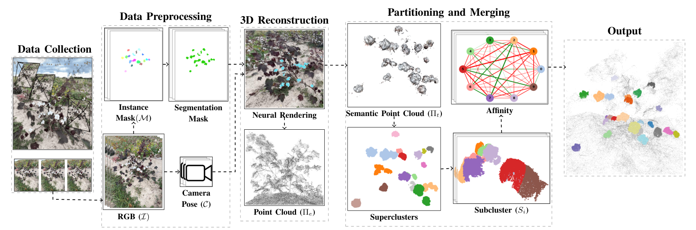

## CropNeRF: A Neural Radiance Field-Based Framework for Crop Counting

### Overview

Rigorous crop counting is crucial for effective agricultural management and
informed intervention strategies. However, in outdoor field environments,
partial occlusions combined with inherent ambiguity in distinguishing clustered
crops from individual viewpoints poses an immense challenge for image-based
segmentation methods.  To address these problems, we introduce a novel crop
counting framework designed for exact enumeration via 3D instance segmentation.

<p align="center">
  
</p>

This repository provides source code for our paper titled "[CropNeRF: A Neural
Radiance Field-Based Framework for Crop Counting]()." Our approach utilizes 2D
images captured from multiple viewpoints and associates independent instance
masks for neural radiance field (NeRF) view synthesis. Concretely, we introduce
crop visibility and mask consistency scores, which are incorporated alongside
3D information from a NeRF model. This results in an effective segmentation of
crop instances in 3D and highly-accurate crop counts. Furthermore, our method
eliminates the dependence on crop-specific parameter tuning. We validate our
framework on agricultural datasets and demonstrate consistent counting
performance despite major variations in crop color, shape, and size. A
comparative analysis against the state of the art highlights superior
performance on crop counting tasks. We also contribute a cotton plant dataset,
3DCotton, to advance further research on this topic.

More information on the project can be found on the [CropNeRF
website](https://robotic-vision-lab.github.io/cropnerf).

### Citation

If you find this project useful, then please consider citing both our paper and
dataset.

```bibitex
@inproceedings{cropNeRF,
  title={CropNeRF: A Neural Radiance Field-Based Framework for Crop Counting},
  author={Al Muzaddid, Md Ahmed and Beksi, William J},
  year={2025}
}

@data{mavmatrix/dataset.2024.05.005,
  title={{3DCotton}},
  author={Al Muzaddid, Md Ahmed and Beksi, William J},
  publisher={MavMatrix},
  version={V1},
  url={https://doi.org/10.32855/dataset.2024.05.005},
  doi={10.32855/dataset.2024.05.005},
  year={2025}
}

```

### CropNeRF Pipeline 

<p align="center">
  
</p>

### Installation 

First, begin by cloning the project

    $ git clone https://github.com/robotic-vision-lab/CropNeRF-A-Neural-Radiance-Field-Based-Framework
    $ cd CropNeRF-A-Neural-Radiance-Field-Based-Framework

Next, build a docker image and then run CropNeRF inside a container

    $ docker build -t cropnerf .
    $ docker run -v {current_directory}:/opt/project -v {data_directory}:/opt/data  -p 0.0.0.0:7007:7007 -it --rm --gpus all cropnerf /bin/bash

Finally, set the enviroment variables
    
    $ export NERFSTUDIO_METHOD_CONFIGS=fruit_nerf=fruit_nerf.fruit_nerf_config:fruit_nerf_method
    $ export PYTHONPATH=$PYTHONPATH:/opt/project/crop_nerf/fruit_nerf

### 3DCotton Dataset 

Download the [3DCotton](...) dataset files. 3DCotton consists of eight
folders of cotton plant data for performing 3D reconstruction. Each folder
contains images and SegmentationObject subfolder. The dataset directories have
the following structure.

```
3DCotton/
  - plant_01
    - images
      - frame_00001.jpg
      - frame_00002.jpg
      - ...
    - SegmentationObject
      - frame_00001.jpg
      - frame_00002.jpg
      - ...
   
  - plant_02
    - images
      - frame_00001.jpg
      - frame_00002.jpg
      - ...
    - SegmentationObject
      - frame_00001.jpg
      - frame_00002.jpg
      - ...
```

### Usage 

#### Covert Segmentation Image to Label Image

    $ python fruit_nerf/utils/convert_segmentation_img_to_label.py 'plant_01'


#### Point Cloud Generation

We utilize the 3D point cloud generation implementation from
[FruitNeRF](https://github.com/meyerls/FruitNeRF). To train a NeRF model to
generate a 3D point cloud, invoke the following commands: 

    $ python debug/train.py fruit_nerf --data /opt/data/training_data/tree_01 --output-dir /opt/data/trained_model
    $ ns-export pointcloud --load-config /opt/data/trained_model/tree_01/fruit_nerf/{filename}/config.yml --output-dir exports/pcd/ --num-points 10000000 --remove-outliers True --normal-method open3d --save-world-frame False --obb_center -0.0571471367 0.1105365818 -0.5400721172 --obb_rotation 0.0000000000 0.0000000000 0.0000000000 --obb_scale 1.0000000000 1.0000000000 1.0000000000
    
#### Segment Pointcloud into Superclusters and Subclusters

    $ python segmentation/segmenter.py tree_01

#### Export Projection from the Model

    $python fruit_nerf/scripts/semantic_projection.py pointcloud --load-config /opt/data/trained_model/tree_01/fruit_nerf/{filename}/config.yml --output-dir /opt/data/outputs/exports/pcd/

#### Merge Subclusters into Crop Instances

    $ python segmentation/merger.py --base_dir {base_directory} --recording_name tree_01

### CropNeRF Source Code License

[](https://github.com/robotic-vision-lab/CropNeRF-A-Neural-Radiance-Field-Based-Framework/blob/main/LICENSE)

### 3DCotton Dataset License

[](https://creativecommons.org/licenses/by-nc-sa/4.0/)
